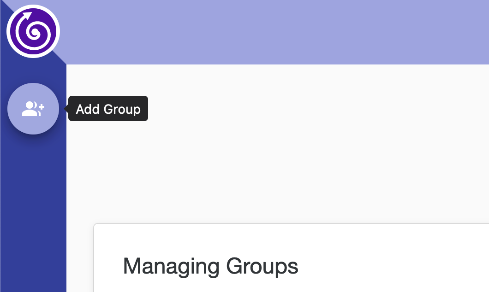
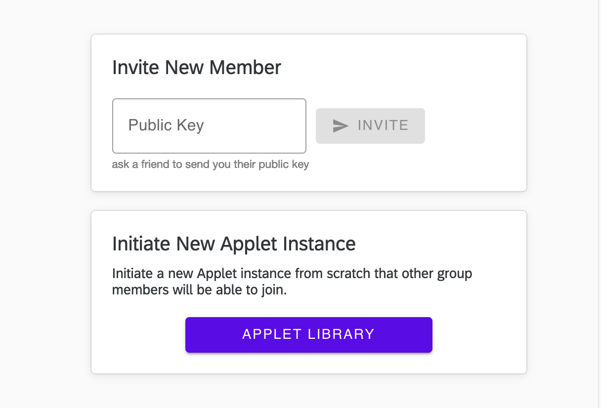
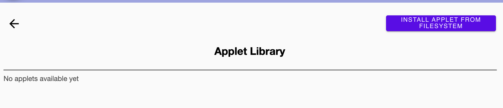
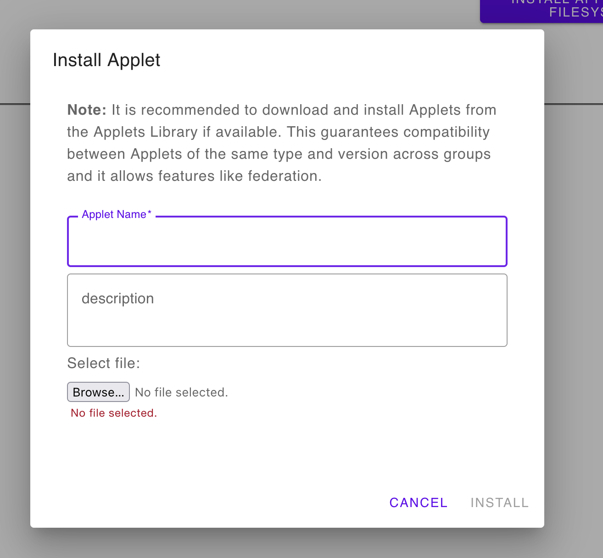

# applet-template
This repository is a template for creating nh-we applets. It is meant to be cloned and provide the basic repository structure and scripts for developing and testing your nh-we applets.

DISCLAIMER: Please note this is only a template that mostly provides repository structure and helpful npm scripts, you will still need to write your own zome functions, entry types, validation functions, and the relevant tests. To speed up this process you can try the [Holochain Scaffolding tool](https://github.com/holochain/scaffolding/) to get basic CRUD functionality and tests scenarios. However, you will still have to implement much of the logic of your application.

## getting started
1. set up your development environment by following the steps in [Environment Setup](#environment-setup)
1. familiarize yourself with the [repository structure](./STRUCTURE.md) and [reactive state management](./REACTIVE-STATE-MANAGEMENT.md) documents and the use of two important dependencies: [`@neighbourhoods/nh-we-applet`](https://www.npmjs.com/package/@neighbourhoods/nh-we-applet) & [`@neighbourhoods/sensemaker-lite-types`](https://www.npmjs.com/package/@neighbourhoods/sensemaker-lite-types)
1. Clone this repository & run `npm i`
1. add your zome code (copy/edit files under to `dna`, `tests` and `ui` folders)
1. replace all instances of `provider` to match your hApp zome name (including in file or directory names)
1. create your applet config and add it to both [`./ui/src/appletConfig.ts`](./ui/src/appletConfig.ts) & [`./we-applet/src/appletConfig.ts`](./we-applet/src/appletConfig.ts). See [Creating Applet Config](#applet-config)
1. build your front end store object (see `providerStore.ts`)
1. test your UI with `npm run start`
1. package your applet as a `.webhapp` file to be imported by nh-we with `npm run package`

## testing your applet in NH Launcher
once you are ready to test your applet in we, you will need to run nh-we in developer mode to upload the webhapp file. To do that:
1. git clone [`nh-we`](https://github.com/neighbour-hoods/nh-we)
1. git fetch and switch to the `develop` branch
1. follow steps in the [read me](https://github.com/neighbour-hoods/nh-we/tree/develop) (`nix-shell`, `npm i`, `npm run start`) to get we running in dev mode (it should launch into the browser)
1. create a we group
    - 
1. create your user in the group
1. go to applet library
    - 
1. select `INSTALL APPLET FROM FILESYSTEM` button
    - 
1. navigate to you applet `.webhapp` file and click `install`
    - 

## Applet Config
The Applet Config is where the **Sensemaker compatible** social interactions of your applet are defined, you can specify:

- **Dimension**s and **Range**s: to define in what ways your users can assess (for example, react or rate) your applet resources (computed dimensions can only receive values from Methods)
- **ConfigResourceType**s: they allow you to map hApp entry-types to sensemaker resources that can receive assessments
- **ConfigMethod**s: they allow performing computations on top of existing __input_dimensions__ into an __output_dimension__, following a __program__ brick (find more about the supported bricks at [this link](https://github.com/neighbour-hoods/sensemaker-lite/blob/develop/docs/program_bricks.md)). 
- **ConfigThreshold**s: they define how a Cultural Context will filter resources to be shown
- **ConfigCulturalContext**s: these allow the SenseMaker to filter and order resources according to rules defined in Thresholds and ordered according to __order_by__.
- **AppletConfigInput**: this object holds together all defined configurations for your Applet.

In the future we are providing a visual Wizard to make the creationg of such config files easier.

## Environment Setup

1. Install the holochain dev environment (only nix-shell is required): https://developer.holochain.org/docs/install/
2. Enable Holochain cachix with:

```bash
nix-env -iA cachix -f https://cachix.org/api/v1/install
cachix use holochain-ci
```

3. Clone this repo and `cd` inside of it.
4. Enter the nix shell by running this in the root folder of the repository: 

```bash
nix-shell
npm install
```

This will install all the needed dependencies in your local environment, including `holochain`, `hc` and `npm`.

Run all the other instructions in this README from inside this nix-shell, otherwise **they won't work**.

## Bootstrapping a network

Create a whole network of nodes connected to each other and their respective UIs with.

```bash
npm run network 3
```

Substitute the "3" for the number of nodes that you want to bootstrap in your network.

This will also bring up the Holochain Playground for advanced introspection of the conductors.

## Running an agent
 
If you only want to run a single conductor and a UI connected to it:

```bash
npm start
```

To run another agent, open another terminal, and execute again:

```bash
npm start
```

Each new agent that you create this way will get assigned its own port and get connected to the other agents.

## Running the DNA tests

```bash
npm run test
```

## Building the DNA

```bash
npm run build:happ
```

## Package

To package the web happ:

``` bash
npm run package
```

You'll have the `provider.webhapp` in `workdir`. This is what you should distribute so that the Holochain Launcher can install it.

You will also have its subcomponent `provider.happ` in the same folder`.

## Documentation

This repository is using this tooling:

- [NPM Workspaces](https://docs.npmjs.com/cli/v7/using-npm/workspaces/): npm v7's built-in monorepo capabilities.
- [hc](https://github.com/holochain/holochain/tree/develop/crates/hc): Holochain CLI to easily manage Holochain development instances.
- [Holochain scaffolding](https://github.com/holochain/scaffolding/): Scaffolding tool used to create simple hApps.
- [@holochain/tryorama](https://www.npmjs.com/package/@holochain/tryorama): test framework.
- [@holochain/client](https://www.npmjs.com/package/@holochain/client): client library to connect to Holochain from the UI.
- [@holochain-playground/cli](https://www.npmjs.com/package/@holochain-playground/cli): introspection tooling to understand what's going on in the Holochain nodes.
